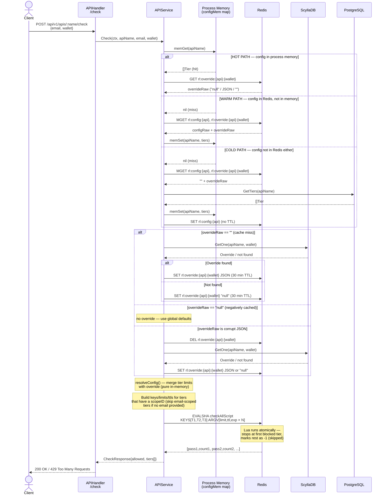

# Check Endpoint — DB Query Flow

`POST /api/v1/apis/:name/check`

## Redis RTT Summary

| Path | Redis RTTs | ScyllaDB | PostgreSQL |
|------|-----------|----------|-----------|
| Hot (memory hit) | **2** — GET override + EVALSHA | 0 | 0 |
| Warm (Redis hit) | **2** — MGET + EVALSHA | 0 | 0 |
| Cold (full miss) | **3** — MGET + SET config + EVALSHA | 0–1 | **1** |
| Override miss | +1 SET after ScyllaDB lookup | **1** | 0 |
